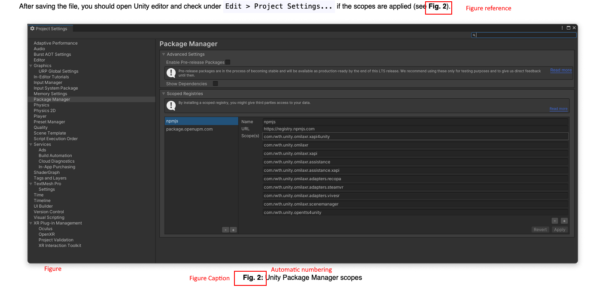

# react-figure-ref
A react component for working with figures and their references. Like in LaTeX you can place figures and reference to them in your content.

## Install
Install in your node package manager of your choice this package. For example in npm just run `npm install --save react-figure-ref`.

You can import now following in your project: `import {FigureManager, Figure, FigureRef} from "react-figure-ref";`

- `FigureManager`: class for handling figures with increasing number of "Fig. 1", "Fig. 2", "Fig. 3", ...
- `FigureRef`: TSX function to place an anker for figure without increasing numbers
- `Figure`: TSX function representing HTML `<figure>` element including caption.

## Usage
We recommend to use FigureManager instead of the separate TSX components. The manager need to be initialized with a list of figures assigned by a label. You can use the label later to place the figures without repeating the src and also to place ankers for it. We used it for example in our Astro project like this:

- `<Figure>` (or `<fm.Figure>`) accepts also the attributes `className`, `style` and `alt`.
- `<FigureRef>` (or `<fm.FigureRef>`) accepts also all attributes for `<a>` tag. 

```js
// GetStartedPresentation.tsx
import {FigureManager} from "react-figure-ref";

export function GetStartedPresentation() {

    const fm = new FigureManager({
        prefix: "Fig.", // (default)
        figures: [
            {label: "step-0", imageSrc: "./get-started/step-0.png"},
            {label: "step-1", imageSrc: "./get-started/step-1.png"},
        ]
    });

    
    return <>
    
        ...

        <p className="pt-3 pb-3">
            After saving the file, you should open Unity editor and check under <InlineCodeBox>Edit &gt; Project
            Settings...</InlineCodeBox> if the scopes are applied (see <fm.FigureRef label="step-1" />).</p>

        <fm.Figure caption="Unity Package Manager scopes" label="step-1" />
        
        ...
    
    </>
}
```
This will end up in following preview. The fm.FigureRef ends up in an link which scrolls you directly to the image.



Thanks for using and please contribute in form of issues or PRs. 